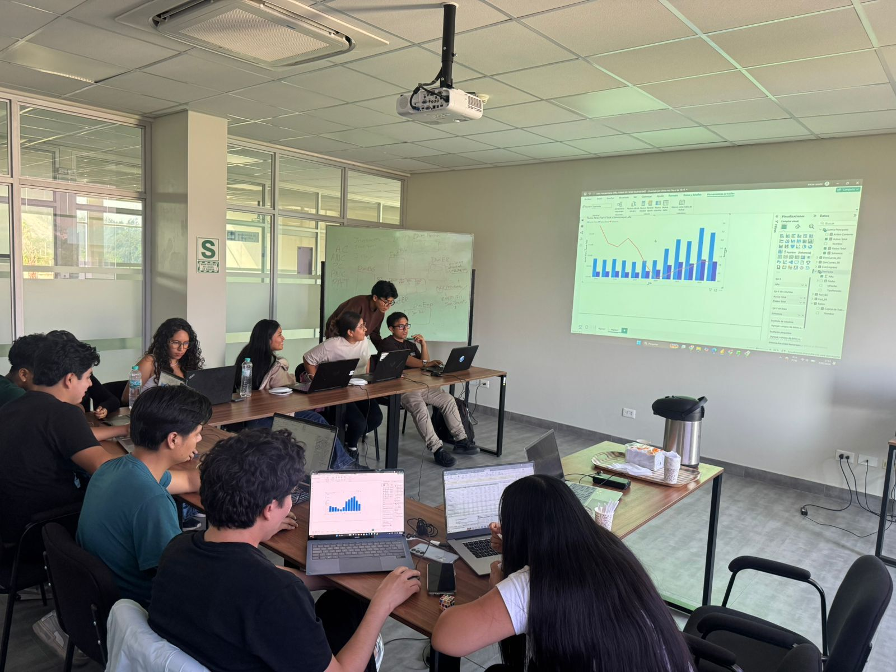
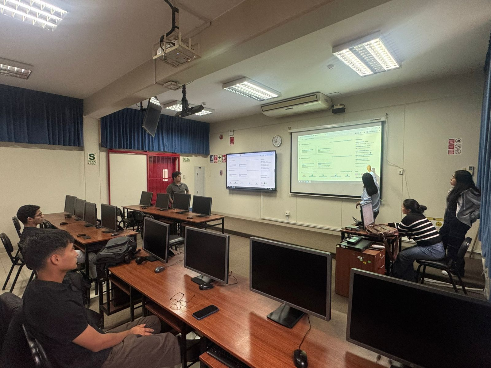
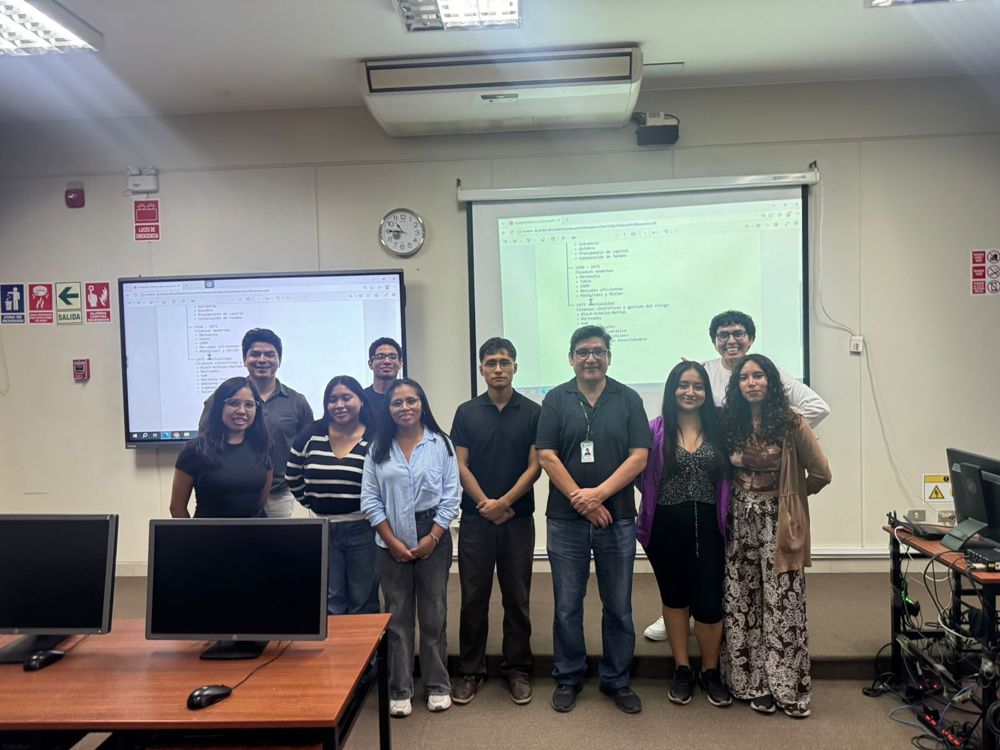

<!-- LOGO (opcional) -->
<!-- 

 -->

<h1 align="center">📈 Applied Finance Day</h1>

  <strong>Evento anual de finanzas aplicadas al sector agroindustrial</strong> 
  <em>Organizado por AFINLAB · UNALM</em>

  
  

---

## 🌿 ¿Qué es el Applied Finance Day?

Es el evento insignia del semillero **AFINLAB**, donde reunimos a estudiantes, profesores y profesionales del sector financiero y agroindustrial. A través de charlas, talleres prácticos y presentaciones de investigación, buscamos **acercar las finanzas modernas al campo peruano** y visibilizar las oportunidades que ofrece la industria agroexportadora.

La primera edición se realizó en 2024 y desde entonces se ha convertido en un espacio de aprendizaje, networking y proyección profesional para los alumnos de la UNALM.

---

## 🖼️ Nuestras reuniones y preparativos

*Detrás del evento hay un gran equipo.*

  <!-- FOTO 1: Reunión de planificación -->
  
  <!-- FOTO 2: Taller de preparación -->
  
   
  <!-- FOTO 3 (opcional): Todo el equipo -->
  
  
Preparando el Applied Finance Day con dedicación y entusiasmo.

---

## 📆 Ediciones

### 🗓️ Applied Finance Day 2025 *(CONSULTAR)*
- **Fecha:** Agosto 2026 (por confirmar)
- **Lugar:** Auditorio principal – UNALM
- **Tema central:** *Estado de las principales empresas agroindustriales peruanas.*
- **Inscripciones:** Próximamente en nuestra web.

---

## 📂 Recursos del repositorio

- `/presentaciones/` – Diapositivas de cada edición.
- `/web/` – Código fuente de la página web del evento (GitHub Pages).
- `/assets/` – Imágenes, flyers y material gráfico.

---

## 👥 Organizadores (*CONSULTAR*)

| Nombre | Rol | Contacto |
|---|---|---|
| [Nombre Apellido] | Coordinador general | [GitHub/LinkedIn] |
| [Nombre Apellido] | Logística y difusión | [GitHub/LinkedIn] |
| ... | ... | ... |

*¿Quieres sumarte como voluntario?* Escribe a [afinlab@lamolina.edu.pe](mailto:afinlab@lamolina.edu.pe) *(CONSULTAR)*

---

## 📌 Mantente al tanto

- 🌐 [Web del evento](https://anfilab.github.io/afinlab-applied-finance-day) *(CONSULTAR)*
- 📷 Instagram: [@afinlab_unalm](https://instagram.com/afinlab.unalm)

---

  AFINLAB · Aplicando finanzas con raíces en el agro 🌱

